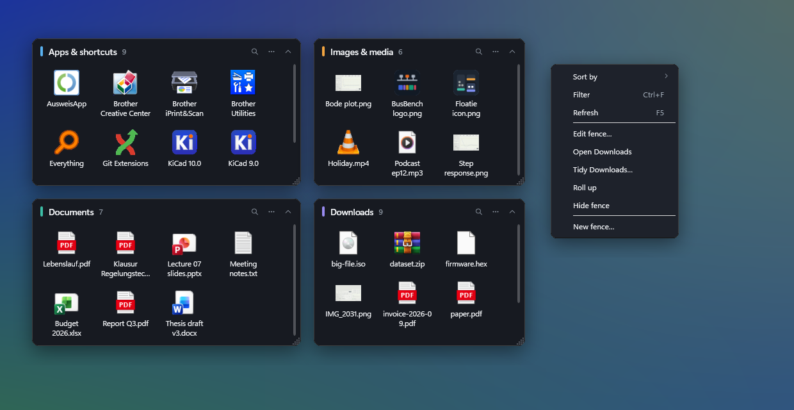
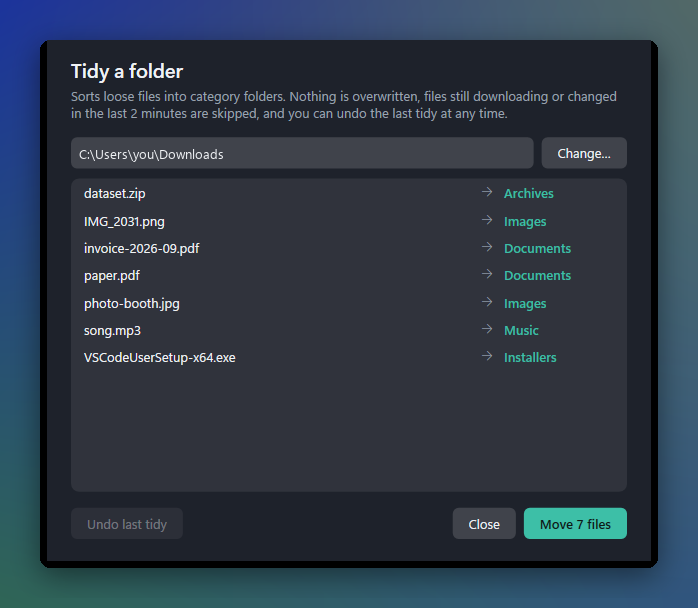
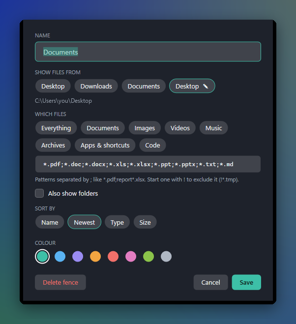

<p align="center">
  <picture>
    <source media="(prefers-color-scheme: dark)" srcset="assets/logo-dark.svg">
    
  </picture>
</p>

<p align="center">
  <b>Live, filtered fences for the Windows desktop.</b><br>
  Your desktop and Downloads sorted into panels that stay put, update themselves, and never touch a file without asking.
</p>

<p align="center">
  <a href="https://github.com/Alifizz01/Floatie/actions/workflows/ci.yml"></a>
  
  
  
  
</p>

<p align="center"></p>

---

## The problem

The Windows desktop is where files go to be forgotten. Downloads, screenshots, the PDF you needed "just for now", forty shortcuts: within a few weeks the desktop is a wall of icons, and finding one file means scanning all of them.

The usual fixes each miss something:

| Approach | What goes wrong |
|---|---|
| Hide desktop icons | Out of sight, still a mess, and the desktop stops being useful |
| Sort into folders by hand | Works for a day; nobody keeps it up |
| Stardock Fences | Paid, and moves your files into its own boxes |
| Scripts that auto-sort Downloads | Run blind: overwrite name clashes, grab half-finished downloads, no undo |

**Floatie** keeps the desktop useful without making you maintain it. Each *fence* is a **live, filtered view** of a real folder: "all PDFs and Office files on my desktop", "everything in Downloads, newest first". Fences update the moment a file appears, work like Explorer (open, rename, drag in and out), and sit on the desktop under your windows. Files stay where they are; a fence only *shows* them.

When a folder does need cleaning up, **Tidy** sorts it into category folders **with a preview first, no overwrites, and one-click undo**.

## Features

**Fences**
- **Live view of any folder**: the Desktop (yours *and* the Public desktop, like Explorer), Downloads, Documents or any folder you pick
- **Filter by type** with one-click presets (Documents, Images, Videos, Music, Archives, Apps & shortcuts, Code) or your own patterns: `*.pdf;report*.xlsx;!*.tmp`
- **Real Windows icons and thumbnails**: app icons for shortcuts, previews for images, videos and PDFs
- **Behaves like Explorer**: double-click or Enter to open, *Open with…*, *Show in Explorer*, F2 rename, Del to Recycle Bin, Ctrl+C, drag files out to any app
- **Drop to move in** (hold Ctrl to copy); name clashes become `file (2).pdf`, never an overwrite
- **Quick filter**: Ctrl+F to type part of a name
- **Sort** by name, newest, type or size, with folders first
- **Roll up** a fence to just its title bar (double-click the title)

**Stays on the desktop**
- Sits **under your windows**, stays visible after Win+D, never shows in the taskbar or Alt-Tab
- **Remembers exactly where you put it**, through restarts, shutdowns and crashes (every move is saved within a second, and again on exit and sign-out)
- If a monitor is unplugged, fences that were on it come back onto the screen
- Survives Explorer restarting: fences rebuild themselves
- Optional: hide Windows' own desktop icons so fences *are* the desktop (restored when Floatie exits)

**Tidy a folder**


- Shows **every move before it happens**
- **Never overwrites**: a clash gets a free name
- **Skips files still downloading** (`.crdownload`, `.part`, …) and anything changed in the last 2 minutes
- Skips files open in another app instead of failing halfway
- **Undo the last tidy** at any time, even after a restart; files moved since are left alone
- Only top-level files are touched; folders and their contents never are

<br clear="right">

**Lightweight**
- Next to no CPU when idle: no polling, no timers. Fences wake only when Windows reports a file change.
- **About 10 MB working set** once started; drawn on the CPU, so it doesn't keep the GPU awake
- Starts with Windows (switch in the tray menu); single instance

## Get it

**Download:** grab `Floatie-win-x64.zip` from [Releases](https://github.com/Alifizz01/Floatie/releases) (or the latest CI artifact), unzip anywhere and run `Floatie.exe`. Nothing to install, and no .NET needed.

On the first start Floatie creates four fences down the right edge (*Apps & shortcuts*, *Documents*, *Images & media*, *Downloads*) and turns on **Start with Windows**. Rearrange them and they stay.

**Build from source** (Windows, .NET 8 SDK):

```powershell
git clone https://github.com/Alifizz01/Floatie
cd Floatie
dotnet test                                  # 29 tests
dotnet run --project src/Floatie
```

## Using it

| To | Do |
|---|---|
| Move a fence | Drag its title (snaps to a 10 px grid) |
| Resize | Drag the bottom-right corner |
| Roll up / down | Double-click the title, or the ˄ button |
| Change what it shows | `⋯` > **Edit fence…** (name, folder, filter, sort, colour) |
| Open, rename, delete | Double-click / F2 / Del, or right-click a file |
| Find a file | Ctrl+F, type; Esc clears |
| Tidy the fence's folder | `⋯` > **Tidy …** |
| Bring back a hidden fence | Tray icon > **Hidden fences** |
| Hide all fences for a moment | Double-click the tray icon |

<p align="center"></p>

**Tray menu:** New fence · Hide/Show fences · Hidden fences · Tidy a folder · Hide Windows desktop icons · Snap to grid · Start with Windows · Open settings folder · Exit.

## How it works

```
src/Floatie
├── Core/            plain C#, no UI, unit-tested
│   ├── FolderLister      what a fence shows: matching, visible entries, folders first
│   ├── PatternMatcher    "*.pdf;!~$*" globs, case-insensitive
│   ├── FileOps           move/copy/rename/recycle, never overwrites
│   ├── FileOrganizer     Tidy: plan, apply, undo (log persisted as JSON)
│   └── SettingsStore     %AppData%\Floatie\settings.json, atomic writes
├── Native/          the Win32 parts
│   ├── Desktop           pin a window to the desktop, desktop-icon switch, autostart
│   └── ShellImages       Explorer's own icons/thumbnails via IShellItemImageFactory
└── Views/           WPF: FenceWindow, FenceEditorWindow, TidyWindow, tray (App)
```

- **Pinned to the desktop:** each fence is a borderless WPF window owned by the desktop's `Progman` window (so Win+D leaves it alone), styled as a tool window (no taskbar or Alt-Tab), and holds the bottom of the z-order by rewriting `WM_WINDOWPOSCHANGING`.
- **Live updates:** a `FileSystemWatcher` per source folder; bursts of events are coalesced into one re-list 500 ms later, done off the UI thread and merged into the list so icons and selection survive.
- **Icons:** `IShellItemImageFactory` gives exactly what Explorer shows; the bitmap is converted by hand to keep its alpha channel, then cached per type (or per file for thumbnails and app icons).
- **Settings safety:** writes go to a temp file and are swapped in, so a crash or power cut can't leave a half-written layout. A corrupt file is kept as `settings.broken.json` rather than silently replaced.

## Settings

Everything lives in `%AppData%\Floatie\settings.json` (human-readable). Set `FLOATIE_HOME` to keep it somewhere else, for example a portable copy or a test sandbox. `last-tidy.json` next to it is the undo log.

## License

MIT © Muhamad Alif Izzuwan Bin Ibrahim
